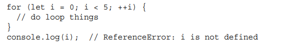

# Language Basic

## 1.Strict Mode

* Using _**strict**_ enforces strict mode, which means stricter parsing and error handling of the JavaScript code. It allows you to catch errors in an erroneous code, whereas in a normal case.
* to enable strict mode for an entire script, include `"use strict";`   at top.
* **adhering to strict mode makes your code generally more optimizable by the engine**

### 题目：

```text
//Question 1
"use strict"
var obj1 = {};
Object.defineProperty(obj1, 'x', { value: 42, writable: false });
obj1.x = 9;

//Question 2, what is the output

(function test() {
    'use strict';
	var fn = function () {
		return this * 2;
	};

	console.log(fn.apply(undefined));
	console.log(fn.apply(null));
	console.log(fn.apply(1));
})();
```

### 解析：

#### Question 1:

* It is readonly property, we would  throw an error since it is not allow to write


#### Question 2:

* use strict can either be used for an entire script or functions. It cannot be used for a block of code enclosed in {} alone. When used inside functions, _**it changes the value of this. It changes from window object to undefined**_
  * When we call a function with apply, the value of this is set to some custom value that is the first parameter to the apply method.
* undefined \* 2  return NaN since, result is not a number
* null &gt;= 0 , so null \*0  return 0
* 1\*2  = 2


## 2. var const let

### var:

* It can be hosited
* It is function scoped, or the global scope if at the top level outside of any function. Wherever a var appears inside a scope, that declaration is taken to belong to the entire scope and accessible everywhere throughout.


* If you try to access a variable's value in a scope where it's not available, you'll get a ReferenceError thrown

```text
function setWidth(){
  var width = 100;

}  
//ReferenceError
con.log(width);
```

### let

* **It is blocked scoped**,it scope does not extend outside the block, 
* **block scope**:It is defined as the nearest set of enclosing curly braces

```text
if (true) {
 var name = 'Matt';
 console.log(name); // Matt
}
console.log(name); // Matt
if (true) {
 let age = 26;
 console.log(age); // 26
}
console.log(age); // ReferenceError: age is not defined 
```

* **It is not allowed hoisted**, Let declaration also does not allow any redundant declarations within a block scope


* **It will not attach to the window** object as they do with var




* **let Declaration in for Loops**  
  * It will declare a new iterator variable for each loop iteration.

### const:

* It behaves identically to that of let but with one important difference—it must be initialized
   with a value, and that value cannot be redefined after declaration.


## 3.Hoisting

* A variable can be declared after it has been used. This is because variable declarations using var hoisted to the top of their functional scope at compile time.
* **Only the declarations get hoisted to the top, not the initializations.**
* **function declaration** are also hoisted, but function expression are not
   function declaration


### 题目

```text
//=====EG1===== 
text ='123';
console.log(text);
var text;
//declarations get hoisted to top,
var text;
text ='123';
console.log(text);


//=====Q1===== 
var temp= 'hi';
function display(){
    console.log(temp);
    var temp = 'bye';
};
display();

```

### 解析：

#### 1: 

* Output 是 undefined
* At compile time, the var temp is hoisted to the top of the display\(\) function.


## 4.Data Type

* There are **6 simple** data type\(primitive types\)
  * String, number, boolean,BigInt, Undefined, symbol
* 1 complex data type, **Object**
  * **3 wrapper Object**
    * Boolean  Number, String
  * null:  null is considered to be
      an empty object reference 
  * **4 subtype of Object**

    * Function, Array,Date,RegExp


    ****


### The typeof Operator:

* It tell the type of a given variable, used them for **primitive type**  data

```text
let message = "some string";
let str = new String('hello world);
console.log(typeof message); // "string"
console.log(typeof str); // "Object" 
console.log(typeof 95); // "number"


typeof null ===> object
```

### What values converted to true?


### What is NaN

* Not a number
* Any operation involving with NaN  always return NaN
* NaN is not equal to any value, use isNaN\(\) to check
* `console.log(NaN == NaN)   // false`
* **isNaN\(\)**: when passed a value, it will try to convert it to a number

```text
console.log(isNaN(NaN)); // true
console.log(isNaN(10)); // false - 10 is a number
console.log(isNaN("10")); // false - can be converted to number 10
console.log(isNaN("blue")); // true - cannot be converted to a number
console.log(isNaN(true)); // false - can be converted to number 1
```

###  Type Conversion/ Concatenate:

* toString\(\)
* parseInt:
  * True -&gt; 1
  * False -&gt; 0
  * Undefined, 或者失误转换为 NaN
  * Null -&gt; 0
* new Boolean\(\)
  * false value will return false;
* **concatenate:**
  * 如果+的 其中一个操作数时字符串， 则 concatenate， 否则 数字加法

```text
var a = '42';
var b ='0';
var c = 42;
var d = 0;
console.log(a+b); //420
```


### Instance of:

* It checks whether the type of the left object belong to the right object in its prototype chain.
* f instanceof foo 
  * f 的 \_\_proto\_\_ 一层一层往上， 能否对应到 Foo.prototype

#### 题目：

```text
// #####Q1#####
var names = ["Tom","Anna",2,true]
console.log(names instanceof String) // false
console.log(names instanceof Number) // false
console.log(names instanceof Object) // true
console.log(names instanceof Array) //true

//#####Q2#####
var str1 = 'This is a string'
var str2 = new String("String using new")
console.log(str1 instanceof String) // false
console.log(str2 instanceof String) //true
console.log(str2 instanceof Object) //true
console.log(str1 instanceof Object) //false
```

#### 解析

2：

* str1 is string literal, and is not created using the **String** object, Hence even though its type is string , it is not an instance of String


## ==  and ===

* == check for value equality with coercion allowed,
* === checks for both value equality without coercion allowed, This is often called strict equality

## 5.equal and not equal:

* Convert equal to 0 or 1 and then compare
* If one is string and another one is number, convert string to number first
* 
  If one is object another one is not, then it will use valueOf\(\)

  * If both are object, they will check if they are the same object,

* Values of null and undefined are equal.
* Values of null and undefined cannot be converted into any other values for equality checking.


## 6.Detecting array:

```text
//Method 1
const a = [];
console.log(a instanceof Array);//true

//Method 2
const a = [];
console.log(a.constructor == Array);//true

//Method 3 例子
const a = ['Hello','Howard'];
const b = {0:'Hello',1:'Howard'};
const c = 'Hello Howard';

console.log(a.toString())//"Hello,Howard"
console.log(b.toString())//"[object Object]"
console.log(c.toString())//"Hello,Howard"

//Method 3
const a = ['Hello','Howard'];
const b = {0:'Hello',1:'Howard'};
const c = 'Hello Howard';
Object.prototype.toString.call(a);//"[object Array]"
Object.prototype.toString.call(b);//"[object Object]"
Object.prototype.toString.call(c);//"[object String]"

const isArray = (something)=>{
    return Object.prototype.toString.call(something) === '[object Array]';
}

//重写了toString方法, method 3前提条件是不能更改 toString()
Object.prototype.toString = () => {
    alert('你吃过了么？');
}
//调用String方法
const a = [];
Object.prototype.toString.call(a);//弹框问你吃过饭没有


//Method 4
const a = [];
const b = {};
Array.isArray(a);//true
Array.isArray(b);//false
```

1.  使用 instanceof 判断
2. 使用 constructor 判断
   1. 但是这个 方法 前提条件是 **constructor 没有被改写**
3. 用Object的toString方法判断， 每一个 继承自 Object的对象都拥有 toString\(\) 方法
   1. 前提条件是 toString\(\) 没有被改写  
   2. 如果一个对象的toString方法没有被重写过的话，那么toString方法将会返回"\[object type\]"，其中的type代表的是对象的类型，根据type的值，我们就可以判断这个疑似数组的对象到底是不是数组了。 **我们不能直接调用 数组的toString 方法**
   3. 从Method3 例子当中，除了对象之外，其他的数据类型的toString返回的都是内容的字符创，只有对象的toString方法会返回对象的类型。所以要判断除了对象之外的数据的数据类型，我们需要“借用”对象的toString方法，所以我们需要使用call或者apply方法来改变toString方法的执行上下文
4. 用Array对象的isArray方法判断, 最靠谱的方法了


## 7.toFixed / toPrecision:

* toFixed: 是从小数点后开始判断
* toPrecision: 判断是从最开始判断

```text
var a = 46.39
console.log(a.toFixed(0))//"46"
console.log(a.toFixed(1))//"46.4"
console.log(a.toPrecision(2))//"46"
console.log(a.toPrecision(3))//"46.4"
```

## 8.How to empty an array

```text
//Method 1
var ary = [1,2,3];

ary =[];
console.log(ary);

//Method 2
var ary = [1,2,3];

ary.length =0;
console.log(ary);

//Method 3 
var ary = [1,2,3];

while(ary.length){
  ary.pop();
  
}
console.log(ary);


// Method 4
var ary = [1,2,3];


ary.splice(0,ary.length); //splice(start, deleteCount) 

console.log(ary);
```

## 9. Arrow function

### Syntax

```text
//Function with no parameter
const identifierName = () => {codeForFunction}
//Function with single parameter
const identifierName = singleParameter => {codeForFunction}
//function with multiple parameters
const identifierName = (functionParameters) => {codeForFunction}
//Single-line function
const identifierName = (functionParameters) => oneLineCode
let double = (x) => { return 2 * x; };
let triple = (x) => 3 * x;
```

### Questions:

#### How does the arrow function differ from other functions?

* Implicitly returns values, the return keyword can be avoided
* Is anonymous,There is no need for a name or the function keyword in an arrow function
* Inherits the value of this from enclosing scope, meaning since they don’t have their own context in which they execute, this gets inherited from the parent function. Hence, they don’t have their own this value.

#### Which of the following are an arrow function's uses cases?

* Managing asynchronous code
  * Using arrow functions in codes using promises or asynchronous callbacks makes the code easier to read and more concise.
* Array manipulation
  * One of the common operations you might need to perform on an array is to map or reduce them. Doing this using arrow functions makes the code more concise and easier to read.

#### What will be the result of clicking on the button?

```text
const button = document.querySelector('#pushy');
button.addEventListener('click', () => {
    this.classList.toggle('on');
});
```

* TypeError, cannot read property 'toggle' of undefined
* In JavaScript, arrow functions do not bind their own this, meaning they inherit the one from the parent scope; this is also known as lexical scoping.Hence, in the code above, if you display the value of this you’ll see that the result will be **window**:


## 10. Understanding function arguments:

```text
//Basic
function sayHi() {
 console.log("Hello " + arguments[0] + ", " + arguments[1]);
}

sayHi('OO','XXX') //"Hello OO, XXX"
```

* when a function is defined using the **function** keyword \(meaning a non-arrow function\), there actually is an **arguments object** that can be accessed while inside a function to retrieve the values of each

  argument that was passed in.

* The arguments object acts like an array \(though it isn’t an instance of Array\)
* can use `arguments.length`


## 11. Rest parameter and spread syntax

### Rest parameter:

```text
function getSum(...values) {
 // Sequentially sum all elements in 'values'
 // Initial total = 0
 return values.reduce((x, y) => x + y, 0);
}
```

*  It allows us to represent an indefinite number of arguments as an array, It has to be the last formal parameter
* **values becomes an array**


### Spread parameter:

```text
let values = [1, 2, 3, 4];
function getSum() {
 let sum = 0;
 for (let i = 0; i < arguments.length; ++i) {
 sum += arguments[i];
 }
 return sum;
}

console.log(getSum(-1, ...values)); // 9
console.log(getSum(...values, 5)); // 15
console.log(getSum(-1, ...values, 5)); // 14
console.log(getSum(...values, ...[5,6,7])); // 28
```

* It break array into  individually and pass each value as a separate argument
* there are no restrictions on other parameters appearing before
   or after the spread operator

### How is rest parameter different with spread syntax?

* It collects values in the form of an array
* Where spread is used to create copies of arrays/objects, rest is used to collect all the remaining values into an array.
* 
  Works in function argument

### What are the benefits of using spread syntax?

* Easy to create copies of arrays
* Easy to create copies of objects
* Beneficial when working with data that should not be mutated


## 12 .Functions:

### new.target in function

```text
function King() {
 if (!new.target) {
 throw 'King must be instantiated using "new"'
 }
 console.log('King instantiated using "new"';
}
new King(); // King instantiated using "new"
King(); // Error: King must be instantiated using "new"
```

* Functions have always been able to behave as both a constructor to instantiate a new object, and

  as a normal callable function

*  New in ECMAScript 6 is the ability to determine if a function was
   invoked with the new keyword using _**new.target**_ If a function is called normally, new.target will
   be undefined. 

### Function properties and methods

```text
function sayName(name) {
 console.log(name);
}

function sum(num1, num2) {
 return num1 + num2;
}

function sayHi() {
 console.log("hi");
}

console.log(sayName.length); // 1
console.log(sum.length); // 2
console.log(sayHi.length); // 0
```

* Each function has two properties: length and prototype. The length property indicates

  the number of named arguments that the function expects

* In strict mode, the this value of a function called without a context
   object is not coerced to window. Instead, this becomes undefined unless explicitly set by either attaching the function to an object or using apply\(\) or call\(\).

## 13. binda & apply 

### bind

### apply


\*\*\*\*


