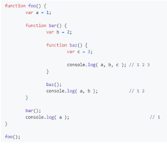

# Language Basic

## 1.Strict Mode

* Using _**strict**_ enforces strict mode, which means stricter parsing and error handling of the JavaScript code. It allows you to catch errors in an erroneous code, whereas in a normal case.
* to enable strict mode for an entire script, include `"use strict";`   at top.

### 题目：

```text
//Question 1
"use strict"
var obj1 = {};
Object.defineProperty(obj1, 'x', { value: 42, writable: false });
obj1.x = 9;

//Question 2, what is the output

(function test() {
    'use strict';
	var fn = function () {
		return this * 2;
	};

	console.log(fn.apply(undefined));
	console.log(fn.apply(null));
	console.log(fn.apply(1));
})();
```

### 解析：

#### Question 1:

* It is readonly property, we would  throw an error since it is not allow to write


#### Question 2:

* use strict can either be used for an entire script or functions. It cannot be used for a block of code enclosed in {} alone. When used inside functions, _**it changes the value of this. It changes from window object to undefined**_
  * When we call a function with apply, the value of this is set to some custom value that is the first parameter to the apply method.
* undefined \* 2  return NaN since, result is not a number
* null &gt;= 0 , so null \*0  return 0
* 1\*2  = 2


## 2. var const let

### var:

* It can be hosited
* It is function scoped, or the global scope if at the top level outside of any function. Wherever a var appears inside a scope, that declaration is taken to belong to the entire scope and accessible everywhere throughout.


* If you try to access a variable's value in a scope where it's not available, you'll get a ReferenceError thrown

```text
function setWidth(){
  var width = 100;

}  
//ReferenceError
con.log(width);
```

### let

* **It is blocked scoped**,it scope does not extend outside the block, 

```text
if (true) {
 var name = 'Matt';
 console.log(name); // Matt
}
console.log(name); // Matt
if (true) {
 let age = 26;
 console.log(age); // 26
}
console.log(age); // ReferenceError: age is not defined 
```

* **It is not allowed hoisted**, Let declaration also does not allow any redundant declarations within a block scope


* **It will not attach to the window** object as they do with var




* **let Declaration in for Loops**  
  * It will declare a new iterator variable for each loop iteration.

### const:

* It behaves identically to that of let but with one important difference—it must be initialized
   with a value, and that value cannot be redefined after declaration.


## 3.Hoisting

* A variable can be declared after it has been used. This is because variable declarations using var hoisted to the top of their functional scope at compile time.
* **Only the declarations get hoisted to the top, not the initializations.**
* **function declaration** are also hoisted, but function expression are not
   function declaration


### 题目

```text
//=====EG1===== 
text ='123';
console.log(text);
var text;
//declarations get hoisted to top,
var text;
text ='123';
console.log(text);


//=====Q1===== 
var temp= 'hi';
function display(){
    console.log(temp);
    var temp = 'bye';
};
display();

```

### 解析：

#### 1: 

* Output 是 undefined
* At compile time, the var temp is hoisted to the top of the display\(\) function.


## Data Type

* There are **6 simple** data type\(primitive types\)
  * String, number, boolean,BigInt, Undefined, symbol
* 1 complex data type, **Object**
  * **3 wrapper Object**
    * Boolean  Number, String
  * null:  null is considered to be
      an empty object reference 
  * **4 subtype of Object**

    * Function, Array,Date,RegExp


    ****


### 3. The typeof Operator:

* It tell the type of a given variable, used them for **primitive type**  data

```text
let message = "some string";
let str = new String('hello world);
console.log(typeof message); // "string"
console.log(typeof str); // "Object" 
console.log(typeof 95); // "number"


typeof null ===> object
```

### What values converted to true?


### What is NaN

* Not a number
* Any operation involving with NaN  always return NaN
* NaN is not equal to any value, use isNaN\(\) to check
* `console.log(NaN == NaN)   // false`
* **isNaN\(\)**: when passed a value, it will try to convert it to a number

```text
console.log(isNaN(NaN)); // true
console.log(isNaN(10)); // false - 10 is a number
console.log(isNaN("10")); // false - can be converted to number 10
console.log(isNaN("blue")); // true - cannot be converted to a number
console.log(isNaN(true)); // false - can be converted to number 1
```

###  Type Conversion/ Concatenate:

* toString\(\)
* parseInt:
  * True -&gt; 1
  * False -&gt; 0
  * Undefined, 或者失误转换为 NaN
  * Null -&gt; 0
* new Boolean\(\)
  * false value will return false;
* **concatenate:**
  * 如果+的 其中一个操作数时字符串， 则 concatenate， 否则 数字加法

```text
var a = '42';
var b ='0';
var c = 42;
var d = 0;
console.log(a+b); //420
```


